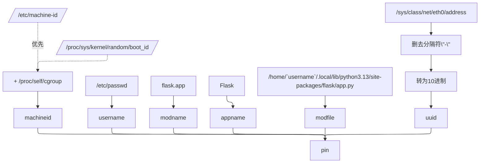

flask中，当我们运行网页实例时指定`run(debug=True)`，或者通过环境变量 `FLASK_DEBUG=1`，我们就可以得到`代码热重载`和`交互式调试器`的新特性，

其中，交互调试器提供了一个`/console`路由（由werkzeug）定义，
这是一个在浏览器中运行的、完全交互式的 `Python Shell`，拥有与运行 Flask 应用的用户完全相同的权限，它必须使用pin码登录，且只允许来自`127.0.0.1`（本地回环）的请求。

pin码的生成具有稳定和唯一性，只要用户名、主机名和项目路径不变，每次生成的 PIN 码都是一样的，这在我们之后阅读源码后就能得知，这个特性确保了pin码在相同的环境下唯一，且不会随机改变。

:::note
目前所有的源码均在Python 3.13，Flask 3.1.2 Werkzeug 3.1.3 版本中翻阅得到，不同版本可能有不同逻辑，请注意区分
:::

## flask>app.py

在Flask(App).run()中，我们传入`debug=True`，这个参数通过`werkzeug.serving.run_simple()`，最终被传入`Werkzeug`

```python title=app.py>Flask>run showLineNumbers startLineNumber=653 "run_simple" {10}
        options.setdefault("use_reloader", self.debug)
        options.setdefault("use_debugger", self.debug)
        options.setdefault("threaded", True)

        cli.show_server_banner(self.debug, self.name)

        from werkzeug.serving import run_simple

        try:
            run_simple(t.cast(str, host), port, self, **options)
        finally:
            # reset the first request information if the development server
            # reset normally.  This makes it possible to restart the server
            # without reloader and that stuff from an interactive shell.
            self._got_first_request = False
```

我们跟进`run_simple`，来到`Werkzeug`的源码下

## werkzeug>serving

```python title=serving.py>run_simple showLineNumbers startLineNumber=1080 "DebuggedApplication"
    if use_debugger:
        from .debug import DebuggedApplication

        application = DebuggedApplication(application, evalex=use_evalex)
        # Allow the specified hostname to use the debugger, in addition to
        # localhost domains.
        application.trusted_hosts.append(hostname)
```

跟进`DebuggedApplication`


## werkzeug>debug>__init__.py

```python title=__init__.py>DebuggedApplication showLineNumbers startLineNumber=313 "get_pin_and_cookie_name"
    @property
    def pin(self) -> str | None:
        if not hasattr(self, "_pin"):
            pin_cookie = get_pin_and_cookie_name(self.app)
            self._pin, self._pin_cookie = pin_cookie  # type: ignore
        return self._pin
```

在这里，我们看到`self._pin`的生成依赖于`get_pin_and_cookie_name()`，跟进这个函数

```python title=__init__.py>get_pin_and_cookie_name showLineNumbers startLineNumber=142
def get_pin_and_cookie_name(
    app: WSGIApplication,
) -> tuple[str, str] | tuple[None, None]:
    """Given an application object this returns a semi-stable 9 digit pin
    code and a random key.  The hope is that this is stable between
    restarts to not make debugging particularly frustrating.  If the pin
    was forcefully disabled this returns `None`.

    Second item in the resulting tuple is the cookie name for remembering.
    """
    pin = os.environ.get("WERKZEUG_DEBUG_PIN")
    rv = None
    num = None

    # Pin was explicitly disabled
    if pin == "off":
        return None, None

    # Pin was provided explicitly
    if pin is not None and pin.replace("-", "").isdecimal():
        # If there are separators in the pin, return it directly
        if "-" in pin:
            rv = pin
        else:
            num = pin

    modname = getattr(app, "__module__", t.cast(object, app).__class__.__module__)
    username: str | None

    try:
        # getuser imports the pwd module, which does not exist in Google
        # App Engine. It may also raise a KeyError if the UID does not
        # have a username, such as in Docker.
        username = getpass.getuser()
    # Python >= 3.13 only raises OSError
    except (ImportError, KeyError, OSError):
        username = None

    mod = sys.modules.get(modname)

    # This information only exists to make the cookie unique on the
    # computer, not as a security feature.
    probably_public_bits = [
        username,
        modname,
        getattr(app, "__name__", type(app).__name__),
        getattr(mod, "__file__", None),
    ]

    # This information is here to make it harder for an attacker to
    # guess the cookie name.  They are unlikely to be contained anywhere
    # within the unauthenticated debug page.
    private_bits = [str(uuid.getnode()), get_machine_id()]

    h = hashlib.sha1()
    for bit in chain(probably_public_bits, private_bits):
        if not bit:
            continue
        if isinstance(bit, str):
            bit = bit.encode()
        h.update(bit)
    h.update(b"cookiesalt")

    cookie_name = f"__wzd{h.hexdigest()[:20]}"

    # If we need to generate a pin we salt it a bit more so that we don't
    # end up with the same value and generate out 9 digits
    if num is None:
        h.update(b"pinsalt")
        num = f"{int(h.hexdigest(), 16):09d}"[:9]

    # Format the pincode in groups of digits for easier remembering if
    # we don't have a result yet.
    if rv is None:
        for group_size in 5, 4, 3:
            if len(num) % group_size == 0:
                rv = "-".join(
                    num[x : x + group_size].rjust(group_size, "0")
                    for x in range(0, len(num), group_size)
                )
                break
        else:
            rv = num

    return rv, cookie_name
```

阅读代码，我们看到pin可以由系统环境变量显式指定，也可由werkzeug生成，

生成的pin主要是以下两部分：

```python
probably_public_bits = [
    username,
    modname,
    getattr(app, "__name__", type(app).__name__), # 应用名称
    getattr(mod, "__file__", None), # 模块文件路径
]

private_bits = [
    str(uuid.getnode()), # 网卡MAC地址
    get_machine_id(),
]
```

### username

先看`username`，跟进到`getpass.getuser()`

`getpass`是Python标准库中的一个单文件模块，用于安全地获取用户输入的敏感信息（如密码），

`getuser()`功能很简单直白，就是获得当前用户的用户名

```python title=getpass.py>getuser showLineNumbers startLineNumber=154
def getuser():
    """Get the username from the environment or password database.

    First try various environment variables, then the password
    database.  This works on Windows as long as USERNAME is set.
    Any failure to find a username raises OSError.

    .. versionchanged:: 3.13
        Previously, various exceptions beyond just :exc:`OSError`
        were raised.
    """

    for name in ('LOGNAME', 'USER', 'LNAME', 'USERNAME'):
        user = os.environ.get(name)
        if user:
            return user

    try:
        import pwd
        return pwd.getpwuid(os.getuid())[0]
    except (ImportError, KeyError) as e:
        raise OSError('No username set in the environment') from e
```

### modname

modname是app对象或类的模块名称

```python
modname = getattr(app, "__module__", typing.cast(object, app).__class__.__module__)
```

### machine_id

跟进到`get_machine_id()`

```python title=werkzeug>debug>__init__.py>get_machine_id showLineNumbers startLineNumber=51
def get_machine_id() -> str | bytes | None:
    global _machine_id

    if _machine_id is not None:
        return _machine_id

    def _generate() -> str | bytes | None:
        linux = b""

        # machine-id is stable across boots, boot_id is not.
        for filename in "/etc/machine-id", "/proc/sys/kernel/random/boot_id":
            try:
                with open(filename, "rb") as f:
                    value = f.readline().strip()
            except OSError:
                continue

            if value:
                linux += value
                break

        # Containers share the same machine id, add some cgroup
        # information. This is used outside containers too but should be
        # relatively stable across boots.
        try:
            with open("/proc/self/cgroup", "rb") as f:
                linux += f.readline().strip().rpartition(b"/")[2]
        except OSError:
            pass

        if linux:
            return linux

        # On OS X, use ioreg to get the computer's serial number.
        try:
            # subprocess may not be available, e.g. Google App Engine
            # https://github.com/pallets/werkzeug/issues/925
            from subprocess import PIPE
            from subprocess import Popen

            dump = Popen(
                ["ioreg", "-c", "IOPlatformExpertDevice", "-d", "2"], stdout=PIPE
            ).communicate()[0]
            match = re.search(b'"serial-number" = <([^>]+)', dump)

            if match is not None:
                return match.group(1)
        except (OSError, ImportError):
            pass

        # On Windows, use winreg to get the machine guid.
        if sys.platform == "win32":
            import winreg

            try:
                with winreg.OpenKey(
                    winreg.HKEY_LOCAL_MACHINE,
                    "SOFTWARE\\Microsoft\\Cryptography",
                    0,
                    winreg.KEY_READ | winreg.KEY_WOW64_64KEY,
                ) as rk:
                    guid: str | bytes
                    guid_type: int
                    guid, guid_type = winreg.QueryValueEx(rk, "MachineGuid")

                    if guid_type == winreg.REG_SZ:
                        return guid.encode()

                    return guid
            except OSError:
                pass

        return None

    _machine_id = _generate()
    return _machine_id
```

在linux系统上，machine_id就是由`/etc/machine-id`和`/proc/self/cgroup`拼接而成的，
当`/etc/machine-id`b不存在时，则会读取`/proc/sys/kernel/random/boot_id`和后者拼接。

## flask中

经过上面的一系列读取，在linux flask服务器上，我们最终会得到pin如下

```python
probably_public_bits = [
    username,        # 当前用户名，能从/etc/passwd或报错信息中读出
    modname,         # 应用模块名，一般为flask.app
    app.__name__,    # 应用名称，一般为Flask
    mod.__file__,    # 模块文件路径，可在报错信息中读出，一般为/home/<username>/.local/lib/python3.13/site-packages/flask/app.py
]

private_bits = [
    uuid.getnode(),  # 网卡MAC地址，可在/sys/class/net/eth0/address中读出16进制串，去掉分割的-转为10进制
    get_machine_id() # 机器唯一ID
]
```

### 一图流




---

[^1]: [flask debug 模式下的pin码](https://squid1lll.github.io/2024/09/20/flask-debug-%E6%A8%A1%E5%BC%8F%E4%B8%8B%E7%9A%84pin%E7%A0%81/)